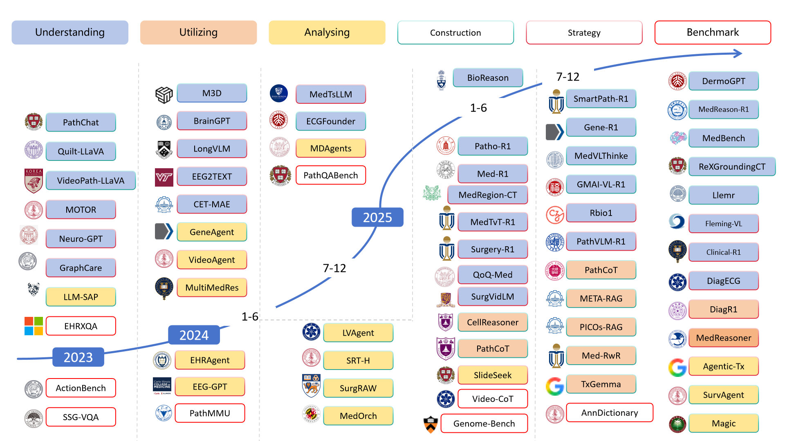

# Towards Autonomous Decision-Making: A Survey of Multimodal Medical Reasoning

[](https://awesome.re)
[](#)
[](https://opensource.org/licenses/MIT)
[](http://makeapullrequest.com)

**📝 Paper source: [`paper/`](paper/) | ✒️ [Citation](#-citation)**

> **Towards Autonomous Decision-Making: A Survey of Multimodal Medical Reasoning**  
> *Haochao Ying*  
> 
> A survey of multimodal medical reasoning models, taxonomies, benchmarks, and resources for increasingly autonomous, evidence-grounded clinical decision-making.

<p align="center">
  
</p>

---

## 📢 News

- 🔥 **[2025/10/22]** Repository initialized with survey structure
- 📚 **[2025/10/22]** Started collecting papers on medical reasoning foundation models
- 🚧 **[Work in Progress]** Survey paper under active development

<details>
<summary>📰 <b>Show More News</b></summary>

- ✍️ Paper writing in progress
- 📊 Collecting and organizing relevant literature
- 🎯 Building comprehensive taxonomy of medical reasoning approaches

</details>

---

## 📋 Table of Contents

- [About](#about)
- [Overview](#overview)
- [Introduction](#introduction)
- [💬 Reasoning in Medical Large Language Models](#-reasoning-in-medical-large-language-models)
  - [2.1 Training-free Strategies](#21-training-free-strategies)
  - [2.2 Training Strategies](#22-training-strategies)
  - [2.3 Extrinsic Strategies](#23-extrinsic-strategies)
- [🎯 Medical Multimodal Reasoning](#-medical-multimodal-reasoning)
  - [3 Understanding Multimodal: Data Curation and Modeling Strategy](#3-understanding-multimodal-data-curation-and-modeling-strategy)
    - [3.1 Motivation and Formulation of Multimodal Understanding in Medicine](#31-motivation-and-formulation-of-multimodal-understanding-in-medicine)
    - [3.2 Reasoning-Oriented Data Curation](#32-reasoning-oriented-data-curation)
      - [3.2.1 Reasoning-Oriented Datasets](#321-reasoning-oriented-datasets)
      - [3.2.2 Reasoning-Aware Curation Strategies](#322-reasoning-aware-curation-strategies)
    - [3.3 Model Design and Training](#33-model-design-and-training)
      - [3.3.1 Modality-Aware Architectures](#331-modality-aware-architectures)
      - [3.3.2 Reasoning-Oriented Objectives](#332-reasoning-oriented-objectives)

  - [4 Utilizing Multimodal Knowledge for Medical Reasoning](#4-utilizing-multimodal-knowledge-for-medical-reasoning)
    - [4.1 Motivation and Formulation of Multimodal Knowledge Utilization in Medicine](#41-motivation-and-formulation-of-multimodal-knowledge-utilization-in-medicine)
    - [4.2 Knowledge Bank Construction](#42-knowledge-bank-construction)
      - [4.2.1 Prompt-Embedded Knowledge](#421-prompt-embedded-knowledge)
      - [4.2.2 Case-Based and Reasoning Trajectory Knowledge Banks](#422-case-based-and-reasoning-trajectory-knowledge-banks)
    - [4.3 Knowledge Utilization Strategies](#43-knowledge-utilization-strategies)
      - [4.3.1 Retrieval-Oriented Reasoning](#431-retrieval-oriented-reasoning)
      - [4.3.2 Iterative Retrieval and Reasoning](#432-iterative-retrieval-and-reasoning)

  - [5 Analyzing Multimodal Reasoning with Agentic Frameworks](#5-analyzing-multimodal-reasoning-with-agentic-frameworks)
    - [5.1 Motivation and Formulation of Agentic Multimodal Analysis](#51-motivation-and-formulation-of-agentic-multimodal-analysis)
    - [5.2 Agentic Analysis Construction](#52-agentic-analysis-construction)
      - [5.2.1 Evidence and Analytical Memory](#521-evidence-and-analytical-memory)
      - [5.2.2 Structured Reasoning Workflows](#522-structured-reasoning-workflows)
    - [5.3 Agentic Analysis Strategy](#53-agentic-analysis-strategy)
      - [5.3.1 Evidence Utilization and Exploration](#531-evidence-utilization-and-exploration)
      - [5.3.2 Reasoning Control and Multi-Agent Coordination](#532-reasoning-control-and-multi-agent-coordination)
- [📊 Benchmarking Medical Reasoning](#-benchmarking-medical-reasoning)
  - [4.1 Benchmark Categories](#41-benchmark-categories)
  - [4.2 Evaluation Metrics](#42-evaluation-metrics)
  - [4.3 Performance Analysis](#43-performance-analysis)
- [🗂️ Medical Domain Datasets](#-medical-domain-datasets)
- [🛠️ Tools and Resources](#-tools-and-resources)
- [📚 Citation](#-citation)
- [🤝 Contributing](#-contributing)
- [⭐ Star History](#-star-history)

---

## About

✨ **A comprehensive collection of research papers, datasets, benchmarks, and tools for medical reasoning in the era of multimodal foundation models** ✨

This repository accompanies our survey paper and provides:
- 📚 **150+ curated papers** on medical reasoning technologies and multimodal foundation models
- 🎯 **Systematic categorization** of reasoning approaches from CoT prompting to reinforcement learning
- 🏥 **Multi-domain coverage** including radiology, pathology, genomics, temporal reasoning, and surgery
- 📊 **Comprehensive benchmarks** across text, imaging, pathology, genomics, ECG/EEG, EHR, and multimodal data
- 🔄 **Regular updates** with the latest research developments
- 💡 **Practical resources** for implementing medical reasoning systems

If you find this repository useful, please consider giving us a ⭐ star to stay updated with the latest developments!

---

## Overview

<p align="center">
  
</p>

Medical reasoning has long been a central topic in artificial intelligence for medicine, referring to the cognitive processes underlying diagnostic and therapeutic decision-making as well as the understanding of disease pathology. This survey systematically analyzes medical reasoning in the age of multimodal foundation models (MFMs), covering both large language models (LLMs) and multimodal reasoning across diverse medical domains.

### Key Highlights

- 🎯 **Comprehensive Coverage**: From training-free prompting strategies to reinforcement learning approaches
- 🏥 **Multi-Domain Analysis**: Radiology (CT/MRI), pathology, genomics, temporal data (ECG/EEG/EHR), and surgical videos
- 🤖 **Diverse Methodologies**: Chain-of-Thought prompting, supervised fine-tuning, reinforcement learning, knowledge augmentation, and agentic systems
- 📈 **Reasoning Technologies**: Systematic analysis of CoT design, reflection mechanisms, RL-based training, and multi-agent frameworks
- 🔬 **Extensive Benchmarking**: Comprehensive evaluation across 8 modality categories with detailed metrics and performance analysis

---

## Introduction

Medical reasoning has long been a central topic in cognitive science and artificial intelligence for medicine, referring to the cognitive processes underlying diagnostic and therapeutic decision-making as well as the understanding of disease pathology. Early AI systems excelled at isolated tasks such as image classification, lesion segmentation, or signal interpretation, but were largely confined to single modalities and lacked multi-step, cross-modal reasoning, limiting their role to assistive tools.

Recent advances in large language models (LLMs) and multimodal foundation models (MFMs) have enabled *autonomous medical decision-making*. By jointly modeling medical images, signals, molecular data, and clinical narratives, these systems support cross-modal evidence synthesis, temporal reasoning, and multi-stage inference. This marks a shift from *AI as a diagnostic tool* to *AI as a decision-making agent* capable of sequential, multimodal clinical judgments. We conceptualize medical multimodal reasoning as a pipeline of three interrelated stages: *understanding multimodal data*, *utilizing multimodal knowledge*, and *analyzing multimodal evidence*.

- **Understanding Multimodal**: data construction and modeling strategy for evidence-based understanding beyond accuracy.
- **Utilizing Multimodal**: explicit construction and strategic use of external knowledge (e.g., knowledge banks and retrieval).
- **Analyzing Multimodal**: agentic workflows for long-horizon, uncertainty-aware, process-sensitive medical decision-making.

### Structure of the Survey

We survey over 200 publications, organizing the survey as follows:

1. Section 2 reviews reasoning methodologies, including training-free, training-based, and extrinsic approaches.
2. Section 3 discusses reasoning-oriented multimodal understanding from data curation and modeling strategy perspectives.
3. Section 4 summarizes knowledge bank construction and retrieval-based strategies for multimodal knowledge utilization.
4. Section 5 reviews agentic frameworks that enable long-horizon, uncertainty-aware multimodal reasoning workflows.
5. Section 6 summarizes benchmarks and evaluation protocols, emphasizing reasoning quality, interpretability, and process-level automation.

### Contribution of the Survey

Unlike prior surveys, which focus on representation or task performance, this work frames *multimodal medical reasoning* as a paradigm for autonomous clinical decision-making. Our contributions are threefold:

1. **Comprehensive synthesis of reasoning mechanisms.** We review training-free prompting, training-based optimization, and extrinsic reasoning approaches that enable multi-step, context-aware clinical inference.
2. **Decision-centric taxonomy.** We distinguish internally unified systems from externally modular systems, clarifying architectural pathways toward autonomy.
3. **Cross-modality analysis.** We map progress across clinical domains, identifying challenges for reliable, interpretable, and process-aware medical AI.

---

## 💬 Reasoning in Medical Large Language Models

This section provides a concise overview of existing reasoning technologies adapted to the medical domain, ranging from CoT prompt design to training strategies and knowledge augmentation.

### 2.1 Training-free Strategies

Training-free strategies enhance medical reasoning without requiring model fine-tuning, primarily through sophisticated prompt engineering techniques.

#### 2.1.1 Chain-of-Thought (CoT) Prompting

Chain-of-Thought prompting ("think step-by-step") strengthens problem-solving performance in medical applications.

| Paper/Model | Venue/Source | Year | Performance | Paper |
|-------------|--------------|------|-------------|-------|
| **ChatGPT on USMLE** | JMIR Med Educ | 2023 | 60.2% MedQA-USMLE, 62.7% MedMCQA, 78.2% PubMedQA | [Link](https://medinform.jmir.org/2023/1/e45312) |
| **GPT-4 Medical Challenge** | arXiv | 2023 | Near passing on USMLE | [arXiv:2303.13375](https://arxiv.org/abs/2303.13375) |
| **LLMs Medical Reasoning** | JAMIA | 2024 | Various benchmarks | [Link](https://academic.oup.com/jamia) |
| **Can LLMs reason about medical questions?** | Patterns | 2024 | Various benchmarks | Patterns (2024) |

**Key Insights:**
- ChatGPT achieved passing-level performance on USMLE through few-shot self-consistent CoT prompting
- GPT-4 demonstrated capabilities on complex medical challenge problems
- Performance highly sensitive to prompt formulation and structure design
- Effective for both closed-ended and open-ended medical questions

#### 2.1.2 Reflection for Reasoning Enhancement

Reflection mechanisms enable models to iteratively improve reasoning through self-evaluation.

| Paper | Venue | Year | Approach |
|-------|-------|------|----------|
| [Med-REFL](https://arxiv.org/abs/2506.13793) | arXiv | 2025 | Adds fine-grained self-reflection loops to filter low-confidence reasoning steps. |
| [LVMed-R2](https://arxiv.org/abs/2504.02885) | arXiv | 2025 | Forces multimodal report generators to verify evidence tokens before final answers. |
| [PathCoT](https://arxiv.org/abs/2507.01029) | arXiv | 2025 | Couples CoT prompting with self-evaluation across cell→tissue→organ levels. |
| [Agentic-Tx (TxGemma)](https://arxiv.org/abs/2504.06196) | arXiv | 2025 | Tool-driven agent that reflects on intermediate outputs for drug development reasoning. |

---

### 2.2 Training Strategies

#### 2.2.1 Supervised Fine-tuning for Medical Reasoning

Supervised fine-tuning adapts foundation models to medical reasoning tasks through curated instruction datasets.

| Model/Paper | Approach | Domain | Year |
|-------------|----------|--------|------|
| [FineMedLM-o1](https://arxiv.org/abs/2501.09213) | SFT + test-time training | General medical QA | 2025 |
| [PathChat](https://www.nature.com/articles/s41586-024-07618-3) | Visual encoder + instruction tuning | Pathology whole-slide copilot | 2024 |
| [BioGPT](https://journals.mesopotamian.press/index.php/MJAIH/article/view/850) | Genomic + clinical fusion SFT | Rare disease & precision medicine | 2025 |
| [MedReason-8B](https://github.com/UCSC-VLAA/MedReason) | KG-grounded instruction tuning | Clinical QA with reasoning chains | 2025 |

#### 2.2.2 Reinforcement Learning for Medical Reasoning

RL-based approaches optimize reasoning policies through reward-driven training.

| Model/Paper | RL Method | Application | Year |
|-------------|-----------|-------------|------|
| [Med-R1](https://arxiv.org/abs/2503.13939) | GRPO + verifiable rewards | Radiology & Med-VQA reasoning | 2025 |
| [GMAI-VL-R1](https://arxiv.org/abs/2504.01886) | RL with clinical consistency rewards | Multimodal diagnosis QA | 2025 |
| [PathVLM-R1](https://arxiv.org/abs/2504.09258) | Dual-reward RL (logic + answer) | Pathology visual-language tasks | 2025 |
| [BioReason](https://arxiv.org/abs/2505.23579) | GRPO over DNA-LLM outputs | Genomic variant reasoning | 2025 |

---

### 2.3 Extrinsic Strategies

#### 2.3.1 Knowledge Augmentation

Integrating external medical knowledge to enhance reasoning capabilities.

| Paper | Knowledge Source | Method | Year |
|-------|------------------|--------|------|
| [medIKAL](https://arxiv.org/abs/2406.14326) | EMR + medical KG | LLM agent that consults KG assistants for diagnosis | 2024 |
| [Leveraging Medical KGs in LLMs](https://ai.jmir.org/2025/1/e58670) | Clinical KG features | Injects KG-derived embeddings during fine-tuning to boost accuracy | 2025 |
| [LLM-powered KG for Mental Health](https://www.nature.com/articles/s41467-025-07526-3) | Multisource patient data | Uses LLMs to build & reason over new knowledge graphs | 2025 |

#### 2.3.2 Agentic Reasoning System

Multi-agent systems that simulate clinical workflows and collaborative decision-making.

| System | Architecture | Application | Year |
|--------|--------------|-------------|------|
| [MDAgents](https://github.com/mitmedialab/MDAgents) | Adaptive multi-agent collaboration | Medical decision-making | 2024 |
| [DynamiCare](https://arxiv.org/abs/2507.01956) | Memory-augmented multi-round agent team | Interactive diagnosis over temporal visits | 2025 |
| [EHRAgent](https://arxiv.org/abs/2401.07128) | Code-executing agent with program-of-thought | Complex tabular EHR reasoning | 2024 |
| [SlideSeek](https://arxiv.org/abs/2506.20964) | Multi-agent pathology copilot | Evidence-grounded WSI diagnosis workflow | 2025 |

---

## 🎯 Medical Multimodal Reasoning

## 3 Understanding Multimodal: Data Curation and Modeling Strategy

### 3.1 Motivation and Formulation of Multimodal Understanding in Medicine

Recent advances in medical AI move beyond isolated perception toward structured multimodal understanding. Instead of focusing solely on single-modality accuracy, modern systems seek to align heterogeneous clinical signals (e.g., imaging, text, waveforms, structured records), ground predictions in meaningful evidence, and preserve reasoning faithfulness. In high-stakes settings, such understanding must ensure interpretability, evidence consistency, and professional validity. Methodologically, it is not simple modality aggregation, but the clinically grounded integration of cross-modal evidence, jointly shaped by reasoning-oriented data curation and modeling strategies that promote diagnostic depth and faithful evidence use.

Accordingly, recent progress can be viewed along two complementary dimensions:

- **Reasoning-Oriented Data Curation**: Designing datasets and supervision signals that promote diagnostic depth, evidence consistency, and cross-modal dependency modeling beyond classification accuracy.  
- **Model Design and Training Strategies**: Developing modality-aware architectures and reasoning-aligned objectives that internalize clinical structure and enforce faithful multimodal integration.

### 3.2 Reasoning-Oriented Data Curation

#### 3.2.1 Reasoning-Oriented Datasets

| Paper                                                        | Key Idea                                                     | Data Scale / Feature                                         | Link                                               |
| ------------------------------------------------------------ | ------------------------------------------------------------ | ------------------------------------------------------------ | -------------------------------------------------- |
| Neural-MedBench                                              | Beyond classification accuracy; evaluates depth and reasoning complexity | Deep reasoning benchmark                                     | https://arxiv.org/abs/2509.22258                   |
| Evaluating Reasoning Faithfulness via Multimodal Perturbations | Tests faithfulness using image modifications                 | Perturbation-based evaluation                                | https://arxiv.org/abs/2510.11196                   |
| Patho-R1                                                     | Multimodal RL-based pathology expert reasoner                | 3.5M image-text pairs, 500K SFT samples                      | https://arxiv.org/abs/2505.11404                   |
| MedVLThinker                                                 | Baselines for multimodal medical reasoning                   | Data filtered by reasoning difficulty                        | https://arxiv.org/abs/2508.02669                   |
| ECG Foundation Model                                         | Large-scale ECG pretraining                                  | 10M+ ECGs, 150 labels                                        | https://www.nature.com/articles/s41586-024-07618-3 |
| M3D                                                          | 3D multimodal medical dataset                                | 120K image-text + 662K instructions                          | https://arxiv.org/abs/2404.00578                   |
| Multimodal Generative AI Copilot for Pathology               | Large instruction corpus                                     | 456K instructions, 999K QA turns                             | https://www.nature.com/articles/s41586-024-07618-3 |
| DermoGPT                                                     | Morphology-grounded dermatology reasoning                    | 211K images, 772K trajectories                               | https://arxiv.org/abs/2601.01868                   |
| MedTrinity-25M                                               | multigranular annotations                                    | image regions, clinical concepts, and report-level description | https://arxiv.org/abs/2408.02900                   |


#### 3.2.2 Reasoning-Aware Curation Strategies

| Paper           | Strategy                            | Core Contribution                          | Link                                           |
| --------------- | ----------------------------------- | ------------------------------------------ | ---------------------------------------------- |
| MedReason-R1    | Reinforcement learning + local zoom | Local region refinement for CT diagnosis   | https://arxiv.org/abs/2510.19626               |
| BioReason       | Variant-network–guided QA synthesis | Multi-step reasoning via LLM distillation  | https://arxiv.org/abs/2505.23579               |
| GMAI-VL-R1      | RL-based reasoning data synthesis   | Step-by-step data via rejection sampling   | https://arxiv.org/abs/2504.01886               |
| ReXGroundingCT  | Three-stage grounding pipeline      | Free-text to segmentation masks            | https://arxiv.org/abs/2507.22030               |
| Quilt-LLaVA     | Cursor-tracked narrative extraction | Spatial grounding from educational videos  | https://ieeexplore.ieee.org/document/10656199/ |
| VideoPath-LLaVA | Video instruction tuning            | Diagnostic reasoning from pathology videos | https://arxiv.org/abs/2505.04192               |

------

### 3.3 Model Design and Training

#### 3.3.1 Modality-Aware Architectures

| Model      | Design Focus                          | Highlight                          | Link                                   |
| ---------- | ------------------------------------- | ---------------------------------- | -------------------------------------- |
| FLEMING-VL | Unified multimodal input              | Universal medical visual reasoning | https://arxiv.org/abs/2511.00916       |
| Med-R1     | Cross-modality generalization         | 8 imaging modalities               | https://arxiv.org/abs/2503.13939       |
| DiagECG    | Discretized ECG tokenization          | LLM-driven ECG reasoning           | https://arxiv.org/abs/2501.01234       |
| MedTsLLM   | Time-series + text fusion             | Patch reprogramming                | https://proceedings.mlr.press/mlhc2024 |
| SurgVidLM  | Multi-grained surgical video modeling | Full-video → clip-level reasoning  | https://arxiv.org/abs/2506.17873       |
| BrainGPT   | Autoregressive EEG foundation model   | Electrode-wise modeling            | https://arxiv.org/html/2410.19779v2    |
| MOTOR      | Time-to-event modeling                | Structured EHR foundation model    | https://arxiv.org/abs/2311.04238       |

#### 3.3.2 Reasoning-Oriented Objectives

| Model       | Optimization Strategy            | Key Mechanism                                                | Link                             |
| ----------- | -------------------------------- | ------------------------------------------------------------ | -------------------------------- |
| QoQ-Med     | Domain-aware GRPO (DRPO)         | Hierarchical domain balancing                                | https://arxiv.org/abs/2506.00711 |
| Clinical-R1 | Clinical Objective RPO (CRPO)    | Accuracy + faithfulness + comprehensiveness                  | https://arxiv.org/abs/2512.00601 |
| Surgery-R1  | RL for surgical reasoning        | Multimodal coherence reward                                  | https://arxiv.org/abs/2506.19469 |
| PATHVLM-R1  | RL-driven pathology reasoning    | Dual reward mechanism                                        | https://arxiv.org/abs/2504.09258 |
| MedE²       | two-stage post-training pipeline | elicits reasoning behavior and enhances multimodal reasoning | https://arxiv.org/abs/2505.23118 |

------

## 4 Utilizing Multimodal Knowledge for Medical Reasoning

### 4.1 Motivation and Formulation of Multimodal Knowledge Utilization in Medicine

While multimodal understanding enables models to interpret heterogeneous signals, effective medical reasoning further depends on how such understanding is supported by structured external knowledge. In real-world practice, clinicians reason through active reference to prior cases, clinical guidelines, and biomedical evidence. Therefore, multimodal systems must explicitly address knowledge utilization—how medical knowledge is constructed, organized, retrieved, and integrated during inference. In medicine, knowledge is hierarchical, evidence-sensitive, and provenance-aware, requiring controlled and reliable incorporation into reasoning processes.

Accordingly, recent progress can be organized into two complementary dimensions:

- **Knowledge Construction**: Externalizing reasoning-relevant information into structured forms, such as prompt-embedded priors, curated case banks, and organized reasoning repositories.
- **Knowledge Utilization Strategies**: Designing mechanisms for knowledge retrieval, selection, and iterative integration that ensure relevance, evidence consistency, and controlled influence on clinical decisions.

### 4.2 Knowledge Bank Construction

#### 4.2.1 Prompt-Embedded Knowledge

| Model   | Knowledge Strategy                 | Link                             |
| ------- | ---------------------------------- | -------------------------------- |
| PathCoT | CoT prompting with self-evaluation | https://arxiv.org/abs/2507.01029 |

#### 4.2.2 Case-Based and Reasoning Trajectory Knowledge Banks

| Model        | Knowledge Source           | Link                                                        |
| ------------ | -------------------------- | ----------------------------------------------------------- |
| SurvAgent    | Hierarchical CoT case bank | https://arxiv.org/abs/2511.16635                            |
| CellReasoner | 380 curated CoT exemplars  | https://www.biorxiv.org/content/10.1101/2025.05.20.655112v1 |

------

### 4.3 Knowledge Utilization Strategies

#### 4.3.1 Retrieval-Oriented Reasoning Strategies

| Model     | Strategy                   | Feature                         | Link                             |
| --------- | -------------------------- | ------------------------------- | -------------------------------- |
| DiagR1    | Prompt argumentation       | RL-trained diagnostic reasoning | https://arxiv.org/abs/2507.18433 |
| META-RAG  | Evidence re-ranking        | Meta-analysis inspired          | https://arxiv.org/abs/2510.24003 |
| PICOs-RAG | Structured query rewriting | PICO-guided RAG                 | https://arxiv.org/abs/2510.23998 |

#### 4.3.2 Iterative Retrieval and Reasoning

| Model    | Mechanism                      | Highlight                      | Link                             |
| -------- | ------------------------------ | ------------------------------ | -------------------------------- |
| Med- RwR | Confidence-driven re-retrieval | Joint reasoning-retrieval loop | https://arxiv.org/abs/2510.18303 |
| TxGemma  | Agentic ReAct framework        | Thought–action interleaving    | https://arxiv.org/abs/2504.06196 |

------

## 5 Analyzing Multimodal Reasoning with Agentic Frameworks

### 5.1 Motivation and Formulation of Agentic Multimodal Analysis

While knowledge utilization equips models with access to external evidence, complex clinical reasoning often requires higher-level organization—explicit analysis, planning, and adaptive control over multi-step decision processes. In practice, diagnosis and treatment planning unfold as structured workflows involving hypothesis generation, evidence revision, and iterative refinement. This motivates agentic multimodal analysis, which formulates reasoning as goal-directed and dynamically organized analytical processes rather than isolated inference steps.

Accordingly, recent developments can be summarized along two complementary dimensions:

- **Analytical Task Decomposition and Planning**: Structuring reasoning into multi-step workflows that decompose clinical problems, manage hypotheses, and coordinate long-horizon decision processes.
- **Action-Oriented Reasoning and Interaction**: Modeling reasoning as sequences of deliberate actions (e.g., retrieval, evaluation, tool invocation, revision) within an interaction loop between the reasoning core and external resources, enabling adaptive and transparent decision-making.

### 5.2 Agentic Analysis Construction

#### 5.2.1 Evidence and Analytical Memory

| Model        | Mechanism                                      | Link                                               |
| ------------ | ---------------------------------------------- | -------------------------------------------------- |
| SurvAgent    | CoT-enhanced case memory                       | https://arxiv.org/abs/2511.16635                   |
| GeneAgent    | Generation–verification–refinement loop        | https://www.nature.com/articles/s41592-025-02748-6 |
| MedAgent-Pro | evidence-based multi-modal diagnostic workflow | https://arxiv.org/abs/2503.18968                   |

#### 5.2.2 Structured Reasoning Workflows

| Model      | Framework                        | Link                                                         |
| ---------- | -------------------------------- | ------------------------------------------------------------ |
| Magic      | Debate-activated graph reasoning | https://www.sciencedirect.com/science/article/pii/S1566253525006293 |
| SurgRAW    | CoT-driven multi-agent workflow  | https://arxiv.org/abs/2503.10265                             |
| LVAgent    | Multi-round agent collaboration  | https://arxiv.org/abs/2503.10200                             |
| VideoAgent | Iterative frame exploration      | https://arxiv.org/abs/2403.10517                             |
| LLM-SAP    | Situational awareness planning   | https://arxiv.org/abs/2312.16127                             |

------

### 5.3 Agentic Analysis Strategy

#### 5.3.1 Evidence Utilization and Exploration

| Model         | Strategy                       | Link                             |
| ------------- | ------------------------------ | -------------------------------- |
| SurvAgent     | Case-based exploration         | https://arxiv.org/abs/2511.16635 |
| VideoAgent    | Iterative visual search        | https://arxiv.org/abs/2403.10517 |
| MMedExpert-RL | domain-specific adaptation     | https://arxiv.org/abs/2601.10949 |
| AgentsEval    | collaborative agents to assess | https://arxiv.org/abs/2601.16685 |

#### 5.3.2 Reasoning Control and Multi-Agent Coordination

| Model                      | Coordination Strategy                           | Link                             |
| -------------------------- | ----------------------------------------------- | -------------------------------- |
| SlideSeek                  | Plan → Region analysis → Grounded summary       | https://arxiv.org/abs/2506.20964 |
| TxGemma                    | ReAct tool-use interleaving                     | https://arxiv.org/abs/2504.06196 |
| MDAgents                   | Adaptive collaboration routing                  | https://arxiv.org/abs/2404.15155 |
| Inquire-Interact-Integrate | Self-evolving zero-shot collaboration           | https://arxiv.org/abs/2405.11640 |
| Evolving Diagnostic Agents | Virtual clinical environment adaptation         | https://arxiv.org/abs/2510.24654 |
| Dr. Assistant              | leveraging structured diagnostic reasoning data | https://arxiv.org/abs/2601.13690 |

## 📊 Benchmarking Medical Reasoning

### Benchmark Categories

Medical reasoning benchmarks span modalities from text-only exams to multimodal clinical toolkits. Below are the key datasets cited in this section (see `paper/sec/sec5-Benchmarking.tex` for the complete table).

#### Text Benchmarks

| Benchmark | Type | Size | Venue/Year | Link |
|-----------|------|------|------------|------|
| ReasonMed | Choice | 370K | arXiv 2025 | [HF](https://huggingface.co/datasets/YuSun-AI/ReasonMed) |
| R2MED | Open-ended | 876 | arXiv 2025 | [GitHub](https://github.com/R2MED/R2MED) |
| ER-REASON | Hybrid | 3,984 | arXiv 2025 | [GitHub](https://github.com/AlaaLab/ER-Reason) |
| LLMEval-Med | Hybrid (ZH/EN) | 2,996 | arXiv 2025 | [GitHub](https://github.com/llmeval/LLMEval-Med) |
| BioProBench | Hybrid | 556K | arXiv 2025 | [HF](https://huggingface.co/datasets/BioProBench/BioProBench) |
| DiagnosisArena | Open-ended | 1,113 | arXiv 2025 | [HF](https://huggingface.co/datasets/shzyk/DiagnosisArena) |
| HV-CR Dataset | Choice (ZH) | 30K | arXiv 2025 | [MedBench](https://medbench.opencompass.org.cn/community/data-station) |
| BioHopR | Open-ended | 10,127 | arXiv 2025 | [HF](https://huggingface.co/datasets/knowlab-research/BioHopR) |
| Med-HALT | Choice | 23,782 | EMNLP 2023 | [HF](https://huggingface.co/datasets/openlifescienceai/Med-HALT) |
| MedExQA | Choice | 965 | arXiv 2024 | [HF](https://huggingface.co/datasets/bluesky333/MedExQA) |
| DiReCT | Open-ended | 511 | NeurIPS 2024 | [GitHub](https://github.com/wbw520/DiReCT) |
| DR.BENCH | Hybrid | 150K | JBI 2023 | [GitLab](https://git.doit.wisc.edu/smph-public/dom/uw-icu-data-science-lab-public/drbench) |
| MedReason | Hybrid + chains | 32,682 | arXiv 2025 | [HF](https://huggingface.co/datasets/UCSC-VLAA/MedReason) |
| MedR-Bench | Hybrid | 1,453 | arXiv 2025 | [GitHub](https://github.com/MAGIC-AI4Med/MedRBench) |
| JAMA Clinical | Choice | 1,832 | NAACL 2025 | [GitHub](https://github.com/HanjieChen/ChallengeClinicalQA) |
| MEDIQ | Choice | 12,901 | NeurIPS 2024 | [HF](https://huggingface.co/datasets/stellalisy/mediQ) |
| MedQA (USMLE) | Choice | 60K+ | Applied Sciences 2021 | [GitHub](https://github.com/jind11/MedQA) |
| PubMedQA | Open-ended | 270K+ | EMNLP 2019 | [GitHub](https://github.com/pubmedqa/pubmedqa) |
| HuatuoGPT-o1 Dataset | Open-ended + verifier | 40K | arXiv 2024 | [HF](https://huggingface.co/datasets/FreedomIntelligence/medical-o1-reasoning-SFT) |

#### Imaging Benchmarks

| Benchmark | Modality | Size | Venue/Year | Link |
|-----------|----------|------|------------|------|
| DeepTumorVQA | 3D CT | 400K+ QA | arXiv 2025 | [HF](https://huggingface.co/datasets/tumor-vqa/DeepTumorVQA_1.0) |
| PadChest-GR | X-ray (ES/EN) | 4,555 QA | arXiv 2024 | [Site](https://bimcv.cipf.es/bimcv-projects/padchest-gr/) |
| ReXVQA | X-ray | 696K+ QA | arXiv 2025 | [HF](https://huggingface.co/datasets/rajpurkarlab/ReXVQA) |
| MediConfusion | Multi-image | 352 cases | arXiv 2024 | [HF](https://huggingface.co/datasets/shahab7899/MediConfusion) |
| MedReasoner / U-MRG-14K | Multi-modality + masks | 14K | arXiv 2025 | [Project](https://pris-cv.github.io/MedReasoner.github.io/) |
| ReXGroundingCT | 3D CT grounding | 3,142 scans | arXiv 2025 | [HF](https://huggingface.co/datasets/rajpurkarlab/ReXGroundingCT) |
| US-SceneGraph | Ultrasound scene graph | 289 samples | arXiv 2025 | [Project](https://noseefood.github.io/us-scene-graph/) |
| LLaVA-Ultra | Ultrasound (ZH) | 188K QA | MM 2024 | [arXiv](https://arxiv.org/abs/2410.15074) |
| HAIBU-ReMUD | Ultrasound | 45K+ | arXiv 2025 | [GitHub](https://github.com/ShiDaizi/ReMUD) |

#### Pathology Benchmarks

| Benchmark | Focus | Size | Venue/Year | Link |
|-----------|-------|------|------------|------|
| PathMMU | QA + explanations | 33,428 | ECCV 2024 | [HF](https://huggingface.co/datasets/jamessyx/PathMMU) |
| PathQABench | MCQ + open-ended | 6 capabilities | Nature 2024 | [Paper](https://www.nature.com/articles/s41586-024-07618-3) |
| Quilt-LLaVA Instruct | Patch-level narratives | 107K | CVPR 2024 | [HF](https://huggingface.co/datasets/wisdomik/QUILT-LLaVA-Instruct-107K) |
| PathChat | WSI dialogues | 456K turns | Nature 2024 | [GitHub](https://github.com/fedshyvana/pathology_mllm_training) |

#### Genomics Benchmarks

| Benchmark | Focus | Size | Venue/Year | Link |
|-----------|-------|------|------------|------|
| BioReason | Multimodal biological reasoning | 87K | arXiv 2025 | [HF](https://huggingface.co/collections/wanglab/bioreason-683cd17172a037a31d208f70) |
| Genome-Bench | Scientific QA | 3,332 | bioRxiv 2025 | [HF](https://huggingface.co/datasets/Mingyin0312/Genome-Bench) |
| Genome-Bench++ | RL-ready benchmark | 3,332 | arXiv 2025 | [GitHub](https://github.com/mingyin0312/RL4GenomeBench) |
| SOAR | Cell annotation arena | 24 tasks | arXiv 2024 | [arXiv](https://arxiv.org/abs/2412.02915) |

#### Surgery Video Benchmarks

| Benchmark | Focus | Size | Venue/Year | Link |
|-----------|-------|------|------------|------|
| CARES | Evidence-grounded error detection | 20 procedures | arXiv 2025 | [arXiv](https://arxiv.org/abs/2508.08764) |
| EndoChat | Grounded endoscopic QA | 41,400 QA | arXiv 2025 | [GitHub](https://github.com/gkw0010/EndoChat) |
| SRT-H | Hierarchical plan following | 34 sequences | arXiv 2025 | [arXiv](https://arxiv.org/abs/2505.10251) |
| Surgery-R1 | Surgical-VQLA + RL | 54K QA | arXiv 2025 | [GitHub](https://github.com/FiFi-HAO467/Surgery-R1) |
| SurgCoTBench / SurgRAW | CoT QA + risk monitoring | 12 cases | arXiv 2025 | [GitHub](https://github.com/jinlab-imvr/SurgRAW) |
| SVU-31K | Multi-grained surgical video | 31K clips | arXiv 2025 | [arXiv](https://arxiv.org/abs/2506.17873) |
| SurgVLM Benchmark | System-level evaluation | - | arXiv 2025 | [arXiv](https://arxiv.org/abs/2506.02555) |

#### ECG/EEG Benchmarks

| Benchmark | Modality | Size | Venue/Year | Link |
|-----------|----------|------|------------|------|
| ECG-QA | ECG question answering | 400K+ QA | NeurIPS 2023 | [GitHub](https://github.com/Jwoo5/ecg-qa) |
| CET-MAE task suite | EEG↔text reconstruction | 4 tasks | ACL 2024 | [ACL](https://aclanthology.org/2024.acl-long.352) |
| EIT-1M | EEG + image + text triples | 1M | arXiv 2024 | [arXiv](https://arxiv.org/abs/2407.01654) |
| EEG-FM-Bench | EEG foundation model eval | 12 datasets | arXiv 2025 | [arXiv](https://arxiv.org/abs/2508.12345) |

#### EHR Benchmarks

| Benchmark | Focus | Size | Venue/Year | Link |
|-----------|-------|------|------------|------|
| Llemr | Instruction tuning for EHR | 260K+ prompts | NeurIPS 2024 | [GitHub](https://github.com/zzachw/llemr) |
| RJUA-MedDQA | Chinese document QA | 2,000 | KDD 2024 | [GitHub](https://github.com/AQ-MedAI/medDQA_benchmark) |
| EHRAgent Programs | Program-of-thought QA | 2,156 | EMNLP 2024 | [GitHub](https://github.com/wshi83/EhrAgent) |
| EHRXQA | EHR + chest X-ray QA | 423K+ | NeurIPS 2023 | [PhysioNet](https://physionet.org/content/ehrxqa/1.0.0/) |
| MDAgents Scenarios | Multi-agent decision making | 180 cases | NeurIPS 2024 | [GitHub](https://github.com/mitmedialab/MDAgents) |

#### Multimodal Benchmarks

| Benchmark | Modalities | Size | Venue/Year | Link |
|-----------|------------|------|------------|------|
| MedXpertQA | Text + imaging | 4,460 | ICML 2025 | [HF](https://huggingface.co/datasets/TsinghuaC3I/MedXpertQA) |
| MultiMedQA++ | Text + instructions | 194K+ | ACL 2024 | [GitHub](https://github.com/promptslab/RosettaEval) |
| MedFrameQA | Video QA | 2,851 | arXiv 2025 | [HF](https://huggingface.co/datasets/SuhaoYu1020/MedFrameQA) |
| BIOMEDICA | Massive multimodal archive | 24M pairs | CVPR 2025 | [HF](https://huggingface.co/BIOMEDICA) |
| DrVD-Bench | Differential diagnosis | 7,789 | arXiv 2025 | [HF](https://huggingface.co/datasets/jerry1565/DrVD-Bench) |
| MEDVLTHINKER Corpus | Image-text instructions | 131K+ | arXiv 2025 | [HF](https://huggingface.co/collections/UCSC-VLAA/medvlthinker-688f52224fb7ff7d965d581d) |
| SMMILE | Multi-agent reasoning | 1,149 | arXiv 2025 | [HF](https://huggingface.co/smmile) |
| Tree-of-Reasoning (TOR) | Multi-agent + multimodal | 952 | arXiv 2025 | [arXiv](https://arxiv.org/abs/2508.03038) |
| BiMediX2 | Bi-lingual multimodal | 160K+ | arXiv 2024 | [GitHub](https://github.com/mbzuai-oryx/BiMediX2) |

---

### Evaluation Metrics

#### Accuracy-Based Metrics

- **Exact Match (EM)**: Percentage of exact correct answers
- **F1 Score**: Harmonic mean of precision and recall
- **BLEU/ROUGE**: Text generation quality metrics
- **Accuracy**: Classification performance

#### Medical-Specific Metrics

- **Clinical Validity**: Expert assessment of clinical correctness
- **Safety Score**: Evaluation of potential harm in outputs
- **Factuality**: Verification against medical knowledge bases
- **Jaccard Similarity**: Multi-disease diagnosis overlap

#### Reasoning Evaluation

- **Reasoning Path Accuracy**: Correctness of intermediate steps
- **Explanation Quality**: Human evaluation of reasoning chains
- **Evidence Grounding**: Pixel/voxel-level alignment accuracy
- **LLM-as-Judge**: GPT-4 evaluation of reasoning quality

---

## 📚 Citation

If you find this survey and repository useful, please consider citing our work:

```bibtex
@article{ying2025medical,
  title={Towards Autonomous Decision-Making: A Survey of Multimodal Medical Reasoning},
  author={Ying, Haochao},
  note={Manuscript in preparation},
  year={2025}
}
```


---

## 🤝 Contributing

We welcome contributions to this repository! Please see our [CONTRIBUTING.md](CONTRIBUTING.md) for guidelines.

### How to Contribute

1. **Add a Paper**: Open an issue or PR with paper details (title, authors, venue, year, link, code)
2. **Update Information**: Fix errors or add missing information
3. **Suggest Categories**: Propose new categorizations or reorganizations
4. **Share Resources**: Add useful tools, datasets, or benchmarks

### Contribution Guidelines

- ✅ Include all required information (paper link, venue, year)
- ✅ Add papers to the appropriate section based on the survey structure
- ✅ Check for duplicates before adding
- ✅ Follow the existing format and style
- ✅ Provide brief descriptions when necessary

---

## ⭐ Star History

[](https://star-history.com/#QiyaoZheng7/try&Date)

---

## 📧 Contact

- **Maintainer**: Haochao Ying
- **Issues**: [GitHub Issues](https://github.com/QiyaoZheng7/try/issues)
- **Discussions**: [GitHub Discussions](https://github.com/QiyaoZheng7/try/discussions)

---

## 📜 License

This project is licensed under the MIT License - see the [LICENSE](LICENSE) file for details.

---

## 🙏 Acknowledgements

We express sincere gratitude to:
- All researchers whose work is featured in this survey
- The open-source community for their invaluable tools and resources
- Contributors who help maintain and improve this repository
- Medical professionals who provide domain expertise and validation

---

<p align="center">
  <i>If you find this repository helpful, please consider giving it a ⭐ star!</i>
  <br>
  <i>Last updated: 2026/01/26</i>
</p>
